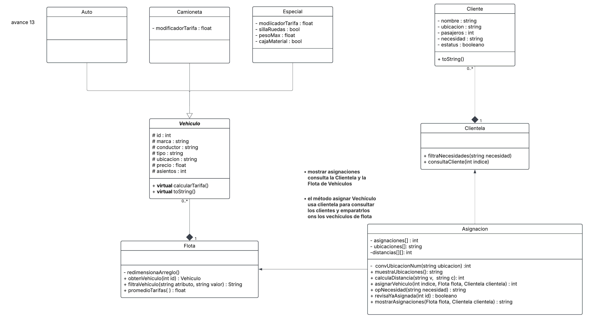

# POO2026DEMO

### Contexto 
En el año 2022, en la ciudad de Ciudad de México, una startup de servicios de transporte llamada "MoviRápido" se enfrenta a un problema en la asignación de vehículos a los clientes. La empresa ha crecido rápidamente y ha aumentado su flota de vehículos, pero ha encontrado dificultades para asignar de manera eficiente y justa los vehículos a los clientes según sus necesidades y ubicaciones. El equipo de desarrollo ha decidido implementar un sistema de asignación utilizando programación orientada a objetos para mejorar la eficiencia y satisfacción del cliente. 

El problema específico radica en la falta de un sistema automatizado que considere múltiples variables, como la ubicación del cliente, la disponibilidad del vehículo y el tiempo estimado de llegada. Las partes involucradas incluyen a los desarrolladores de software, el equipo de operaciones y los conductores. El equipo ha decidido utilizar un lenguaje de programación orientado a objetos para diseñar y desarrollar esta solución. Los desarrolladores deben modelar el sistema utilizando diagramas de clases en UML y asegurar que la solución sea adaptable a diferentes escenarios de demanda y oferta. 
 
### Usuarios
El program está enfocado a 3 tipos de usuarios: 

1. conductores: consultar el viaje a realizar
2. clientes: realizar una solicitud de viaje
3. operadores de la compañía: obtener reportes sobre la asiganciones actuales, los clientes y los conductores
   
### Funcionalidad
En el programa actual se puede:

1. Agregar petición , se crea una petición por cliente donde se especifica la necesidad y con esto se asigna el servicio. se atiendes 3 tipos de necesidades:

   1.1 transporte normal de 1 a 4 personas,

   1.2 transporte camioneta se atiende de 5 a 7 personas,

   1.3 transporte espcial que puede tener silla de ruedas o cajas para carga de material de 500 kg o 1000 kg. 
                     

3. Asignar vehículos , se asignan los vahículos registrados en el programa para atender las peticiones de los clientes. La asignación se base primero en el tipo de necesidad registrada, después en el número de pasajeros y la ubicación.

4. Mostrar asignaciones, se genera un reporte sobre las asignaciones realizadas para que los administradores del servicio lo puedan revisar
   
5. Generar reportes, se permiten realizar diversos reportes desde la plataforma sobre los vehículos y los clientes.

### Forma de calcular costos:

Los costos del tranporte se calculan con la relación tarifa especifica del transporte y la distancia.  Las tarifas dependen del tipo de transporte que se requiera para cubir las necesidades del cliente y el precio base del vehículo. Se usa la siguiente lógica para determinar los precios:

    modificadores:
      camioneta -> 1.5

      necesidad especial  : silla de ruedas  ->   2.0
                            cajaMaterial 500 ->   1.8
                            cajaMaterial 1000 ->  2.1

    tarifa = precio_base * modificador

    costo_viaje = tarifa * distancia

### Criterio de Asignación:

Para asignar un vehículo primero se da prioridad a la necesidad del cliente, se filtran aquellos vehículos que cumplan con la necesidad. Posteriormente se calcula la distancia entre los vehículos válidos y el cliente, y se le asigna el más cercano (menor costo para esa necesidad), ya que está la asignación se estima el costo del viaje. Si hay empates, se atiende primero a la solicitud con misma prioridad de necesidad. 

### Diseño del prorgama (Diagrama de clases UML)

Este grupo de clases se conecta con la clase main donde se integra el programa completo.

### Notas de la Implementación
En el diagrama se tienen sobrecargados los métodos heredados de la clase Vehículo entodas las clases hijas.
Las relaciones de composición tiene implementadas en las clases los métodos para crear y borrar objetos, así como los arreglos y contadores correspondientes de cada tipo de objeto.

### Pruebas por clase

Cada función involucrada en el proceso se prueba de forma separada y se compara contra el comportamiento esperado en el diseño de la prueba. 
Adicionalmente se prueba el uso de las clases creadas y sus métodos para cada una:

 * Prueba 1.-Vehiculo
 * Prueba 2.-Cliente
 * Prueba 3.-Clientela
 * Prueba 4.-Auto
 * Prueba 5.-Camioneta
 * Prueba 6.-Especial
 * Prueba 7.- Flota

### Pruebas de Escenarios Diferentes 
En el archivo pruebas.cpp se pueden ver las pruebas diseñadas para 3 escenarios extremos para la clase de Asignación:

 * Prueba 8.-cuando no hay clientes (caso base)
 * Prueba 9.-cuando hay clientes (caso promedio)
 * Prueba 10.-cuando se excede el número de clientes que se pueden asignar (caso extremo)

### Guía de Estilo
Para mantener buen estilo en el código me basé en los materiales del curso y en la siguiente guía de recomendaciones de estilo:  https://lefticus.gitbooks.io/cpp-best-practices/content/03-Style.html# 
